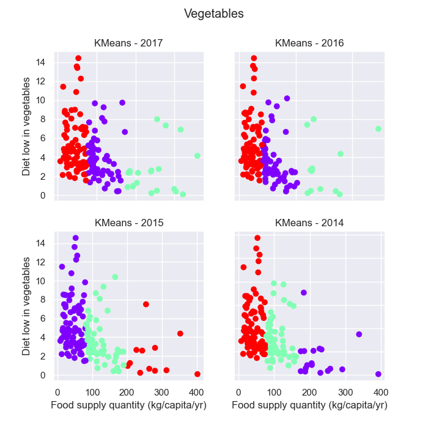
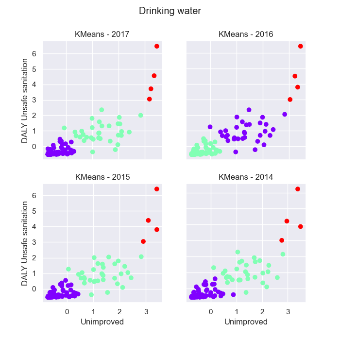
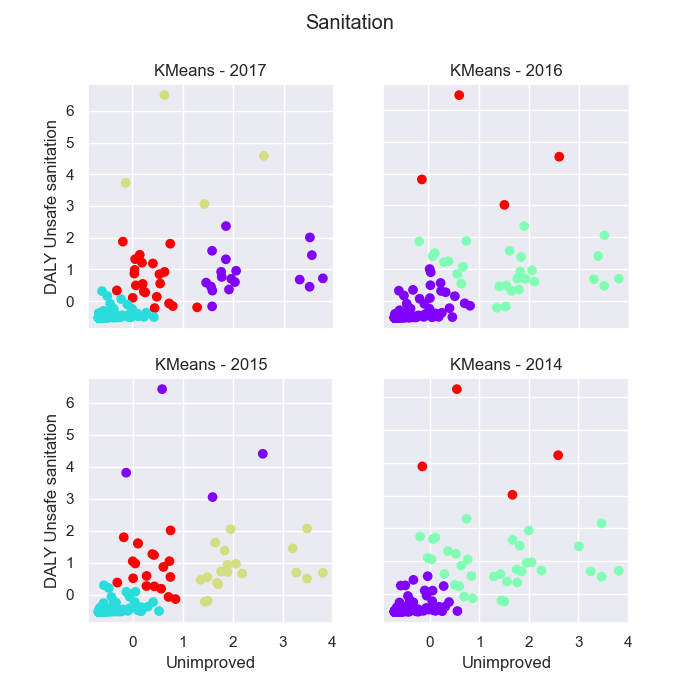
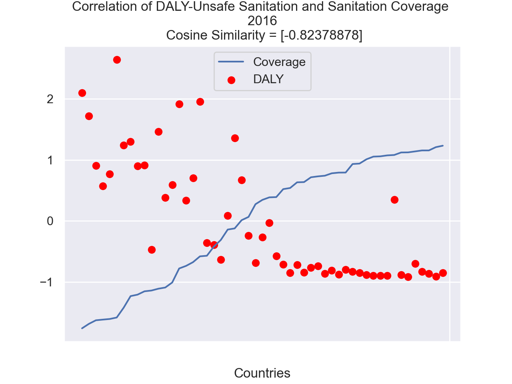
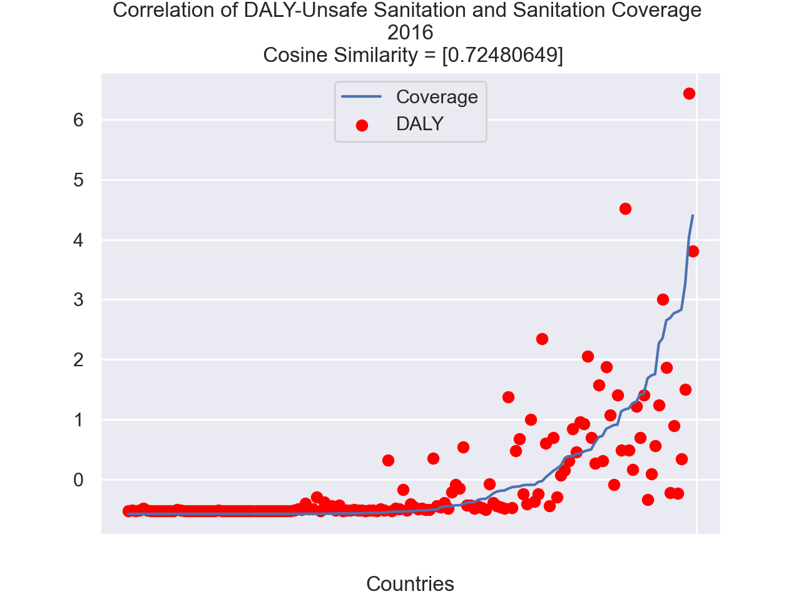

# Fall Project - CSC 422 / 522 - ALDA

## Table of Content
1. [About](#about)
2. [Project Structure](#project-strcuture)
3. [Installation](#installation)
4. [Algorithms](#algorithms)
5. [Results](#results)
7. [Meet the contributors](#meet-the-contributors)

## About

The significance of the impact of food on health is evident from the prominent saying "An apple a day keeps the doctor away". Food, water and shelter are considered to be the basic necessities for human sustenance. The quality of the food we eat, the water we drink and the environment we live in impacts the quality of our health. If we lack in any of these attributes the consequences of it are seen on our health and this is evident from prior research work performed in the field. Taking into consideration, the current unprecedented times the necessity to understand the correlation between these factors at a deeper level has been the need of the hour to improve global health. Hence, through this project, we aim to explore the impact of nutrition, water quality and sanitation data on country wise disease burden across the globe.

## Repository Structure

The repository consist of all the python classes used to develop the project
```
> data
    > contains the preprocessed data
> src
    > run.py - Starting point of the code for running the clustering algorithms
    > preprocessor.py - All Preprocessing methods
    > water_sanitation.py - Preprocessing Hygiene dataset
    > clustering.py - Implement K-Means and DBSCAN algorithm
    > analyze.py - Function that reads the data and runs the clustering methods on the datasets
    > main.py - Starting point of the code for preprocessing
    > helper.py - Contains the helper function to read from and write to csv files
    > images
        > results
            > kmeans - contains the plots for KMeans clustering
            > dbscan - contains the plots for DBSCAN clustering
```

## Installation

### Pre-requisite

1. Download the dataset from [Google Drive](https://drive.google.com/drive/folders/16Z-EBEd3ZhRhYy_GXqaxqu_jMoBS_7H5?usp=sharing)
Add the dataset to the `data` folder

2. Install all packages
```
pip install -r requirement.txt
```

### How to run

Run the clustering algorithm using the following command
```
python src/run.py
```

The results can be seen in the ``src/results/images`` folder.

## Algorithms

### K-Means
We use the method, KMeans which is a partitional clustering algorithm that divides the data objects into non-overlapping groups. In other words, no object can be a member of more than one cluster, and every cluster must have at least one object. Conventional k-means requires only a few steps. The first step is to randomly select k centroids, where k is equal to the number of clusters we choose. Centroids are data points representing the center of a cluster. The algorithm then iteratively assigns each data point to its nearest centroid. Following this, the algorithm computes the mean of all the points for each cluster and sets the new centroid. This process is repeated until the centroids remain unchanged.

### DBSCAN
Based on a set of points, DBSCAN groups together points that are close to each other based on a distance measurement (usually Euclidean distance) and a minimum number of points. It also marks as outliers the points that are in low-density regions.

### Cosine Similarity
Cosine similarity is defined as the cosine of the angle between two vectors, and is an effective measure of similarity between two vectors. It lies in the range [-1,1] with -1 indicating strongly negative correlation, 0 indicating decorrelation, and 1 indicating a strong correlation between the two values.
## Results
Clustering the data using KMeans and DBSCAN, and applying cosine similarity, we found patterns
indicating that nutrition, water and sanitation of a country hugely impacts its health (in terms of
DALYs) for the years 2014-2017.

### DALYs(Diet low in vegetables) v/s  Vegetables Food Supply
The dataset ‘Food Balances 2014 - 2018’ provides information about the amount of food supply
quantity of different food items in each country. Segregating all the vegetables out of these food
items, we were able to find the total vegetables produce (kg/capita/yr) and establish a relation with
the DALYs due to diet low in vegetables(from the dataset ‘Disease burden by risk factor’) 



### Impact of drinking water service on DALYs
The dataset ‘Drinking Water, Sanitation, Hygiene’ provides us with the percentage of population that has access to different levels of drinking water in each country. Our analysis lead to the following clusters for the DALY’s due to poor quality of drinking water(from dataset ‘Disease burden by risk factor’) and the percentage of a country’s population that has access to unimproved drinking water.



### Impact of sanitation service on DALYs
The dataset ‘Drinking Water, Sanitation, Hygiene’ provides data of the percentage of population that has access to different levels of sanitation in each country. We found the following clusters for the DALY’s due to poor quality of sanitation(from our dataset ‘Disease burden by risk factor’) and the percentage of a country’s population that has access to unsafe sanitation.


Establishing this relationship between DALYs(Unsafe Sanitation) and the access of different levels of sanitation, we employed cosine similarity to measure how strongly these attributes were correlated with each other.




## Meet the contributors

1. [Ayan Kapoor](https://github.ncsu.edu/akapoor8)
2. [Eshita Arza](https://github.ncsu.edu/sarza)
3. [Rahul Kalita](https://github.ncsu.edu/rkalita)
